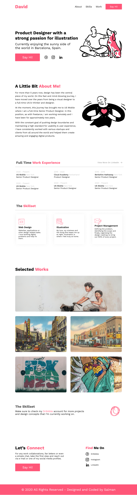

# Full Portfolio landing page for a Product Designer.

## Welcome! 👋

Thank you for taking out time to check out this project.

**To complete this project, I made use of HTML and CSS**

## The Project

This project is a Porfolio landing page for a Product designer - David. The design was provided by [Bahd Coder](https://twitter.com/bahdcoder), I developed it making sure it looked as close to the design as possible.

I also ensured the users were able to:

- See hover states for all interactive elements on the page

Working on this project, I was able to:

- Build a project from scratch using data and files from figma.
- Improve my skills working on a real-life workflow

The site is not responsive yet, but I'll be working on it soon.

## Live URL

https://insure-landing-page-five-xi.vercel.app/

🚀
